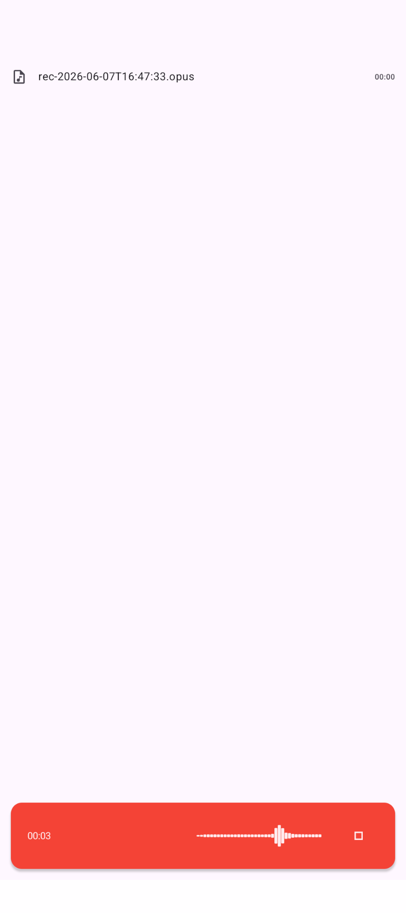
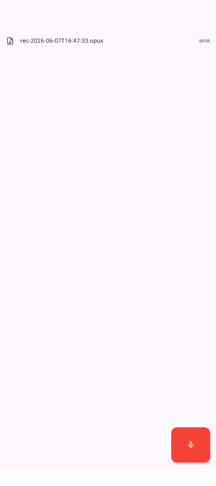
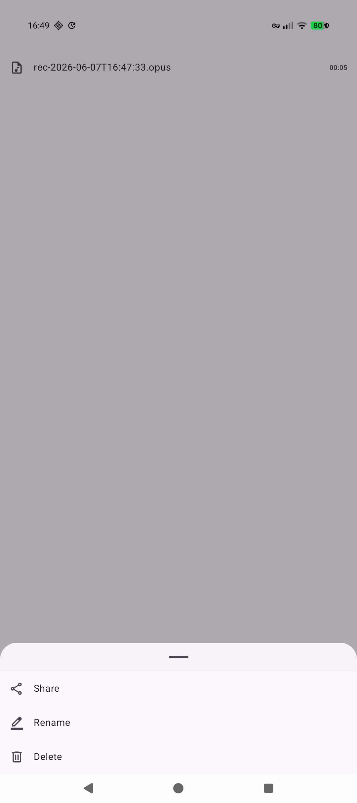

# Recorder

A super simple audio recorder app that fulfills my needs.

## Usage

An APK built by the GitHub Action in this repo is provided in releases,
and can also be downloaded from any successful CI run.
To build it yourself the usual Android Studio workflow or `./gradlew` can be used.

## Screenshots

|||||
|-|-|-|-|
|Start screen with no recordings|While recording|After recording|File context menu|

## License

AGPL-3.0-or-later